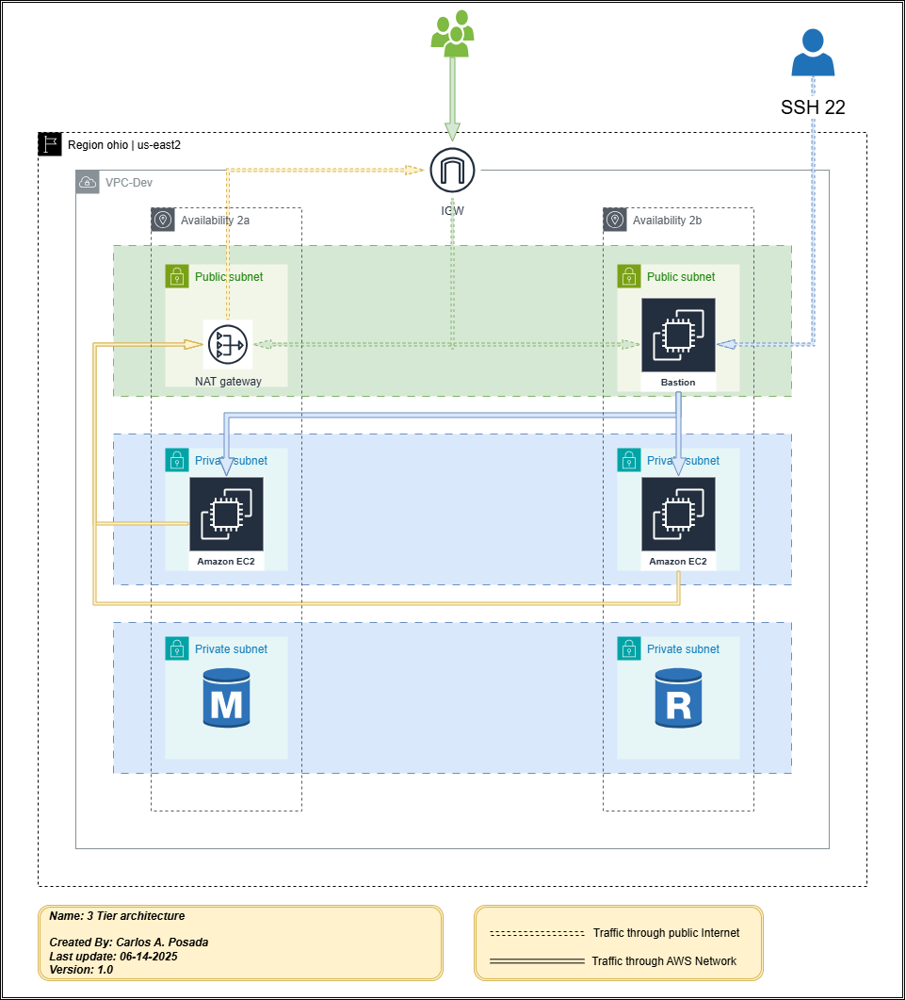

# Terraform: Modular AWS 3-Tier VPC with Bastion, NAT, and Security Groups



## Overview

This project demonstrates a **modular and production-ready** approach to building a secure, multi-AZ, 3-tier VPC architecture on AWS using Terraform.  
It features:
- Full modularization (VPC, Security Groups, EC2)
- Best practices for variable and local value management
- OS-aware local-exec provisioners
- Infrastructure as Code (IaC) for repeatable, scalable deployments

---

## 1. Architecture

**Components:**
- **VPC** with custom CIDR, public/private/database subnets across 2 AZs
- **Internet Gateway** and **NAT Gateway** for controlled internet access
- **Bastion Host** in a public subnet for secure SSH access
- **Private EC2 Instances** in private subnets
- **Security Groups** with descriptive rules
- **Local-exec provisioners** for logging creation/destruction events

See the diagram above for a visual representation.

---

## 2. Modular Structure

This project is fully modularized for clarity and reusability:

```
07-Ec2-sg/
├── main.tf
├── locals.tf
├── variables.tf
├── outputs.tf
├── modules/
│   ├── vpc/
│   ├── security-groups/
│   ├── ec2/
│   └── scripts/
├── 3-tier-terraform.png
└── ...
```

- **main.tf**: Orchestrates the deployment, wiring module outputs/inputs.
- **modules/vpc**: Defines the VPC, subnets, NAT, and routing.
- **modules/security-groups**: Manages all security groups, using advanced rule descriptions.
- **modules/ec2**: Launches bastion and private EC2 instances, EIP, and user-data.
- **modules/scripts**: Contains user-data scripts for EC2 provisioning.

**Key Principle:**  
> All dependencies and associations between resources are managed in the root `main.tf`.  
> Each module is a "black box" with well-defined inputs/outputs, making the codebase easy to maintain and extend.

---

## 3. Variable & Local Management

- **variables.tf**: Declares all input variables (region, environment, subnets, etc.).
- **locals.tf**: Computes derived values (e.g., naming prefix, common tags) for DRY code.
- **terraform.tfvars / *.auto.tfvars**: Used for environment-specific values.

**Example: Common Tags via Locals**
```hcl
locals {
  prefix = "${var.environment}-${var.name_region}-${var.customer}"
  common_tags = {
    owners      = local.owners
    environment = local.environment
    ManagedBy   = "terraform"
    Project     = "terraform-vpc-infrastructure"
    # ...
  }
}
```
These are passed to all modules for consistent tagging.

---

## 4. Security Groups with Descriptions

Security group rules are defined using the advanced `ingress_with_cidr_blocks` argument, allowing you to add a `description` to each rule for clarity:

```hcl
ingress_with_cidr_blocks = [
  {
    rule        = "ssh-tcp"
    cidr_blocks = "0.0.0.0/0"
    description = "Allow SSH access from anywhere to the bastion host"
  }
]
```
This makes it easy to understand the purpose of each rule when revisiting the project.

---

## 5. Local-Exec Provisioners & OS Compatibility

This project uses `local-exec` provisioners to log resource creation and destruction events.  
**Important:**  
- The commands are written for **PowerShell** to ensure compatibility with Windows.
- If you run this code on Linux (e.g., in a CI/CD pipeline), you must adapt the commands to use `bash` syntax.

**Example (Windows/PowerShell):**
```hcl
provisioner "local-exec" {
  command     = "Add-Content -Path 'creation-time-vpc-id.txt' -Value \"VPC created on $(Get-Date -Format 'yyyy-MM-dd HH:mm:ss') and VPC ID: ${module.vpc.vpc_id}\""
  working_dir = "local-exec-outputs-files/"
  interpreter = ["PowerShell", "-Command"]
}
```
**To run on Linux:**  
Replace with `echo ... >> file.txt` and remove the `interpreter` argument.

---

## 6. Outputs

The root module exposes key outputs for integration and debugging:
- `vpc_id`
- `vpc_cidr_block`
- `private_subnets`
- `public_subnets`
- `nat_public_ips`
- `azs`

---

## 7. How to Use

1. **Customize** your variables in `terraform.tfvars` or `*.auto.tfvars`.
2. **Initialize** the project:
   ```sh
   terraform init
   ```
3. **Plan** the deployment:
   ```sh
   terraform plan
   ```
4. **Apply** the changes:
   ```sh
   terraform apply
   ```

---

## 8. Best Practices Highlighted

- Modular, reusable code
- Explicit variable passing (no hidden dependencies)
- Consistent tagging via locals
- Descriptive security group rules
- OS-aware scripting for local-exec
- Clean separation of concerns

---

**Explore the code and diagram to see these concepts in action!** 