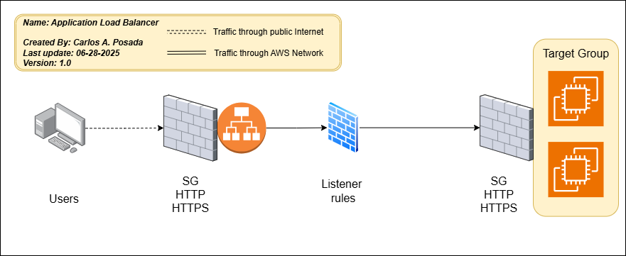
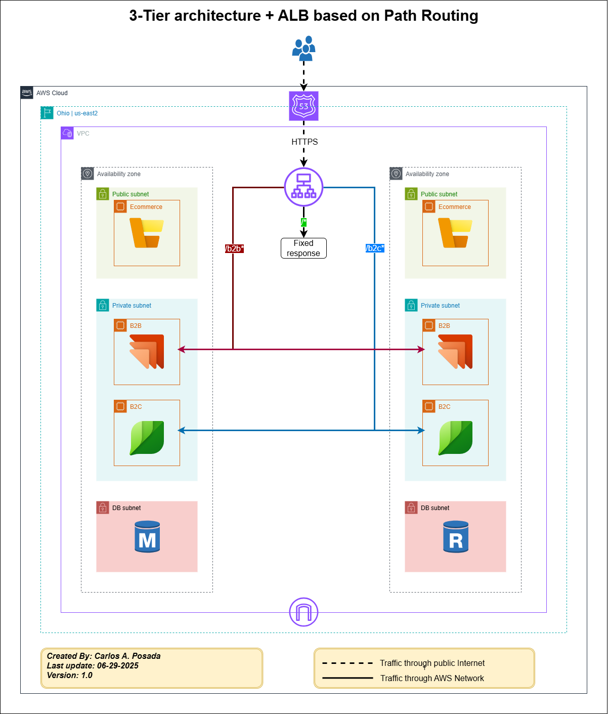

# 08-Load-balancers

## 📋 Overview

This section demonstrates different types of AWS Load Balancers and their configurations using Terraform. We implement Application Load Balancers (ALB) with various routing strategies including path-based routing, host header routing, query string routing, custom headers, and redirects.

## 🏗️ Architecture

### ALB Basic Networking



### ALB Path Routing



## 📁 Project Structure

```
08-Load-balancers/
├── main.tf                          # Main configuration file
├── variables.tf                     # Variable definitions
├── outputs.tf                       # Output values
├── versions.tf                      # Terraform and provider versions
├── locals.tf                        # Local values
├── data.tf                          # Data sources
├── route53.tf                       # Route53 DNS configuration
├── null-resource-provisioners.tf    # Provisioners for logging
├── local-exec-outputs-files/        # Output files from provisioners
│   ├── creation-time-vpc-id.txt
│   └── destroy-time.txt
└── modules/
    ├── acm/                         # SSL Certificate management
    │   ├── acm.tf
    │   ├── outputs.tf
    │   └── variables.tf
    ├── ec2/                         # EC2 instances
    │   ├── ami-datasource.tf
    │   ├── ec2-bastion.tf
    │   ├── ec2-private-b2b.tf
    │   ├── ec2-private-b2c.tf
    │   ├── eip.tf
    │   ├── outputs.tf
    │   └── variables.tf
    ├── load-balancers/              # Load balancer modules
    │   ├── alb-basic/               # Basic ALB without ASG
    │   │   ├── alb-basic.tf
    │   │   ├── outputs.tf
    │   │   └── variables.tf
    │   ├── alb-path/                # ALB with path-based routing
    │   │   ├── alb-path.tf
    │   │   ├── outputs.tf
    │   │   └── variables.tf
    │   ├── alb-host-header/         # ALB with host header routing
    │   │   ├── alb-host-header.tf
    │   │   ├── outputs.tf
    │   │   └── variables.tf
    │   └── clb/                     # Classic Load Balancer
    │       ├── clb.tf
    │       ├── outputs.tf
    │       └── variables.tf
    ├── scripts/                     # User data scripts
    │   ├── b2b.sh
    │   └── b2c.sh
    ├── security-groups/             # Security group configurations
    │   ├── outputs.tf
    │   ├── sg-alb.tf
    │   ├── sg-bastion.tf
    │   ├── sg-private.tf
    │   └── variables.tf
    └── vpc/                         # VPC configuration
        ├── outputs.tf
        ├── variables.tf
        └── vpc.tf
```

## 🔧 Load Balancer Types

### 1. Classic Load Balancer (CLB)
- **File**: `modules/load-balancers/clb/`
- **Use Case**: Legacy applications, simple load balancing
- **Features**: Layer 4/7 load balancing, health checks

### 2. Application Load Balancer - Basic (ALB Basic)
- **File**: `modules/load-balancers/alb-basic/`
- **Use Case**: Modern applications, path-based routing
- **Features**: Layer 7 load balancing, target groups, health checks

### 3. Application Load Balancer - Path Routing (ALB Path)
- **File**: `modules/load-balancers/alb-path/`
- **Use Case**: Microservices, API versioning
- **Features**: Path-based routing, multiple target groups

### 4. Application Load Balancer - Host Header (ALB Host Header)
- **File**: `modules/load-balancers/alb-host-header/`
- **Use Case**: Multi-tenant applications, subdomain routing
- **Features**: Host header routing, custom headers, redirects, query string routing

## 🎯 ALB Rules and Priorities

### Understanding Rule Priorities

ALB rules are evaluated in order of priority (lower numbers = higher priority). The first matching rule is applied.

### Current Rule Configuration

```terraform
rules = {
  # Priority 1: Host header routing for API
  host_header_api = {
    priority = 1
    actions = [{
      type             = "forward"
      target_group_key = "tg1"
    }]
    conditions = [{
      host_header = {
        values = ["api.carlos-aws-hands-on-labs.click"]
      }
    }]
  }

  # Priority 2: Host header routing for Web
  host_header_web = {
    priority = 2
    actions = [{
      type             = "forward"
      target_group_key = "tg2"
    }]
    conditions = [{
      host_header = {
        values = ["web.carlos-aws-hands-on-labs.click"]
      }
    }]
  }

  # Priority 3: Custom header rule
  custom_header_rule = {
    priority = 3
    actions = [{
      type             = "forward"
      target_group_key = "tg2"
    }]
    conditions = [{
      http_header = {
        http_header_name = "custom-header"
        values           = ["testing", "stg", "staging"]
      }
    }]
  }

  # Priority 11: Path-based routing for B2B (with host header)
  b2b_path = {
    priority = 11
    actions = [{
      type = "weighted-forward"
      target_groups = [
        {
          target_group_key = "tg1"
          weight           = 1
        }
      ]
      stickiness = {
        enabled  = true
        duration = 3600
      }
    }]
    conditions = [
      {
        host_header = {
          values = ["api.carlos-aws-hands-on-labs.click"]
        }
      },
      {
        path_pattern = {
          values = ["/b2b*"]
        }
      }
    ]
  }

  # Priority 12: Path-based routing for B2C (with host header)
  b2c_path = {
    priority = 12
    actions = [{
      type = "weighted-forward"
      target_groups = [
        {
          target_group_key = "tg2"
          weight           = 1
        }
      ]
      stickiness = {
        enabled  = true
        duration = 3600
      }
    }]
    conditions = [
      {
        host_header = {
          values = ["web.carlos-aws-hands-on-labs.click"]
        }
      },
      {
        path_pattern = {
          values = ["/b2c*"]
        }
      }
    ]
  }

  # Priority 13: Query string redirect
  redirect_query = {
    priority = 13
    actions = [{
      type        = "redirect"
      status_code = "HTTP_302"
      host        = "techgenies.com"
      path        = "/data-artificial-intelligence/"
      query       = ""
      protocol    = "HTTPS"
    }]
    conditions = [
      {
        host_header = {
          values = ["apps.carlos-aws-hands-on-labs.click"]
        }
      },
      {
        query_string = {
          key   = "service"
          value = "data-artificial-intelligence"
        }
      }
    ]
  }

  # Priority 14: Host header redirect
  redirect_hh = {
    priority = 14
    actions = [{
      type        = "redirect"
      status_code = "HTTP_302"
      host        = "techgenies.com"
      path        = "/cloud-infrastructure-services/"
      query       = ""
      protocol    = "HTTPS"
    }]
    conditions = [{
      host_header = {
        values = ["apps.carlos-aws-hands-on-labs.click"]
      }
    }]
  }
}
```

### Rule Evaluation Order

1. **Priority 1**: `api.carlos-aws-hands-on-labs.click` → B2B Target Group
2. **Priority 2**: `web.carlos-aws-hands-on-labs.click` → B2C Target Group
3. **Priority 3**: Custom header `testing/stg/staging` → B2C Target Group
4. **Priority 11**: `api.carlos-aws-hands-on-labs.click/b2b*` → B2B Target Group
5. **Priority 12**: `web.carlos-aws-hands-on-labs.click/b2c*` → B2C Target Group
6. **Priority 13**: `apps.carlos-aws-hands-on-labs.click?service=data-artificial-intelligence` → Redirect to techgenies.com
7. **Priority 14**: `apps.carlos-aws-hands-on-labs.click` → Redirect to techgenies.com

## 🚀 Getting Started

### Prerequisites

1. **AWS CLI configured** with appropriate permissions
2. **Terraform** installed (version >= 1.0)
3. **Domain name** registered in Route53
4. **SSH key pair** created in AWS

### Configuration

1. **Update variables** in `terraform.tfvars`:
```hcl
instance_keypair = "your-key-pair-name"
domain_name      = "your-domain.com"
```

2. **Enable required modules** in `main.tf`:
```hcl
# For ALB Path and Host Header modules, enable ACM
module "acm" {
  source = "./modules/acm"
  # ... configuration
}

# Choose one load balancer module at a time
module "alb_host_header_routing" {
  source = "./modules/load-balancers/alb-host-header"
  # ... configuration
}
```

### Testing Different Load Balancers

#### 1. Classic Load Balancer (CLB)
```hcl
# In main.tf, uncomment:
module "classic_load_balancer" {
  source = "./modules/load-balancers/clb"
  # ... configuration
}
```

#### 2. ALB Basic
```hcl
# In main.tf, uncomment:
module "alb_without_asg" {
  source = "./modules/load-balancers/alb-basic"
  # ... configuration
}
```

#### 3. ALB Path Routing
```hcl
# In main.tf, uncomment:
module "alb_path_routing" {
  source = "./modules/load-balancers/alb-path"
  # ... configuration
}
```

#### 4. ALB Host Header (Current Active)
```hcl
# In main.tf, uncomment:
module "alb_host_header_routing" {
  source = "./modules/load-balancers/alb-host-header"
  # ... configuration
}
```

## 🧪 Testing

### 1. Basic Connectivity Tests

```bash
# Test domain endpoints
curl https://api.carlos-aws-hands-on-labs.click
curl https://web.carlos-aws-hands-on-labs.click
curl https://apps.carlos-aws-hands-on-labs.click
```

### 2. Path-Based Routing Tests

```bash
# B2B service
curl https://api.carlos-aws-hands-on-labs.click/b2b/index.html

# B2C service
curl https://web.carlos-aws-hands-on-labs.click/b2c/index.html
```

### 3. Custom Header Rule Testing (Priority 3)

**Using Postman:**

1. **Open Postman**
2. **Create a new request**
3. **Set method to GET**
4. **Set URL**: `https://carlos-aws-hands-on-labs.click`
5. **Add Headers tab**:
   - Key: `custom-header`
   - Value: `testing` or `stg` or `staging`
6. **Send request**

**Expected Result**: Request should be routed to B2C Target Group

**Using cURL:**
```bash
# Test with custom header
curl -H "custom-header: testing" https://carlos-aws-hands-on-labs.click
curl -H "custom-header: stg" https://carlos-aws-hands-on-labs.click
curl -H "custom-header: staging" https://carlos-aws-hands-on-labs.click
```

### 4. Redirect Tests

```bash
# Query string redirect (Priority 13)
curl -I "https://apps.carlos-aws-hands-on-labs.click?service=data-artificial-intelligence"
# Expected: 302 redirect to techgenies.com/data-artificial-intelligence/

# Host header redirect (Priority 14)
curl -I "https://apps.carlos-aws-hands-on-labs.click"
# Expected: 302 redirect to techgenies.com/cloud-infrastructure-services/
```

### 5. Health Check Tests

```bash
# Check B2B health
curl https://api.carlos-aws-hands-on-labs.click/b2b/index.html

# Check B2C health
curl https://web.carlos-aws-hands-on-labs.click/b2c/index.html
```

## 🔍 Monitoring and Troubleshooting

### Check ALB Status
```bash
# Get ALB details
aws elbv2 describe-load-balancers --names dev-ohio-truMed-LLC-hh-alb

# Get target group health
aws elbv2 describe-target-health --target-group-arn <target-group-arn>
```

### Check Security Groups
```bash
# Verify ALB security group
aws ec2 describe-security-groups --group-ids <alb-sg-id>
```

### Check Route53 Records
```bash
# Verify DNS records
aws route53 list-resource-record-sets --hosted-zone-id <zone-id>
```

## 🏗️ Networking Architecture

### ALB Network Flow

```
Internet →  Route53 → ALB → Target Groups → EC2 Instances
    ↓         ↓        ↓          ↓              ↓
   HTTPS     DNS    Security    Health       Application
   (443)    Query    Groups     Checks        (HTTP/80)
```

### Security Group Configuration

- **ALB Security Group**: Allows HTTPS (443) from internet
- **EC2 Security Group**: Allows HTTP (80) from ALB security group
- **Bastion Security Group**: Allows SSH (22) from specific IPs

### Target Group Configuration

- **B2B Target Group**: Routes to B2B instances, health check `/b2b/index.html`
- **B2C Target Group**: Routes to B2C instances, health check `/b2c/index.html`

## 📊 Performance Considerations

### ALB Features Used

1. **Sticky Sessions**: Enabled for session persistence
2. **Health Checks**: Configured for automatic failover
3. **SSL Termination**: Handled at ALB level
4. **Cross-Zone Load Balancing**: Enabled for high availability

### Best Practices

1. **Rule Priorities**: Use gaps between priorities for future additions
2. **Health Checks**: Configure appropriate intervals and thresholds
3. **Security Groups**: Follow principle of least privilege
4. **Monitoring**: Enable CloudWatch metrics and logs

## 🧹 Cleanup

```bash
# Destroy all resources
terraform destroy

# Remove local files for Linux or MacOS
rm -rf .terraform
rm -f *.tfstate*

# Remove local files for Windows (PowerShell)
Remove-Item -Recurse -Force .terraform
Remove-Item -Force *.tfstate*
```

## 📚 Additional Resources

- [AWS ALB Documentation](https://docs.aws.amazon.com/elasticloadbalancing/latest/application/)
- [Terraform AWS ALB Module](https://registry.terraform.io/modules/terraform-aws-modules/alb/aws/latest)
- [ALB Best Practices](https://docs.aws.amazon.com/elasticloadbalancing/latest/application/application-load-balancer-best-practices.html)